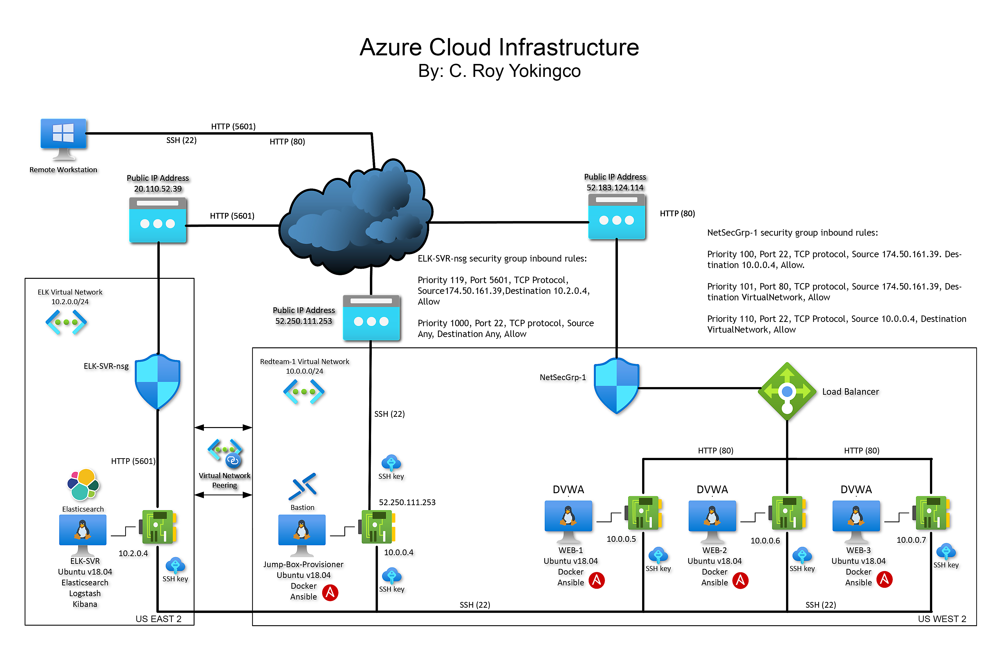
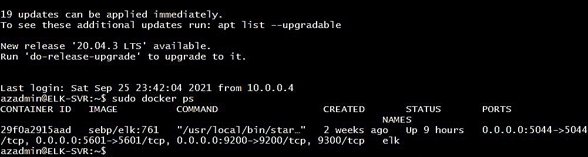

## Automated ELK Stack Deployment

The files in this repository were used to configure the network depicted below.

These files have been tested and used to generate a live ELK deployment on Azure. They can be used to either recreate the entire deployment pictured above. Alternatively, select portions of the playbook files may be used to install only certain pieces of it, such as Filebeat.

  - [ELK Server Playbook File](Playbooks/install-elk.yml)	

This document contains the following details:
- Description of the Topology
- Access Policies
- ELK Configuration
  - Beats in Use
  - Machines Being Monitored
- How to Use the Ansible Build

### Description of the Topology

The main purpose of this network is to expose a load-balanced and monitored instance of DVWA, the Damn Vulnerable Web Application.

Load balancing ensures that the application will be highly available, in addition to restricting access to the network.

Integrating an ELK server allows users to easily monitor the vulnerable VMs for changes to the file system and system metrics.
- Filebeat monitors for changes in files and generates logs on the file system.
- Metricbeat records system metrics like system uptime, CPU workloads, memory usage, etc.

The configuration details of each machine may be found below.

|   Name   	|             Function             	| IP Address 	| Operating System 	|
|:--------:	|:--------------------------------:	|:----------:	|:----------------:	|
| Jump Box 	|       Gateway/Provisioning       	|  10.0.0.4  	| Linux v18.04 LTS 	|
|   Web-1  	|            HTTP Server           	|  10.0.0.5  	| Linux v18.04 LTS 	|
|   Web-2  	|            HTTP Server           	|  10.0.0.6  	| Linux v18.04 LTS 	|
|   Web-3  	|            HTTP Server           	|  10.0.0.7  	| Linux v18.04 LTS 	|
|  ELK-SVR 	| Data Acquisition  & Analytics 	|  10.2.0.4  	| Linux v18.04 LTS 	|

### Access Policies

The machines on the internal network are not exposed to the public Internet. 

Only the Jump Box machine can accept connections from the Internet. Access to this machine is only allowed from the following IP addresses:
- sticky static IP address (174.50.161.39) from my home ISP vendor (Comcast).

Machines within the network can only be accessed by the Jump Box.
- All machines within the 10.0.0.0 network can communicate with the ELK server because of the peering         configuration between the two virtual subnets. 

A summary of the access policies in place can be found in the table below.

| Server Name 	|    Publicly Accessible   	|             Allowed IP Address            	|
|:-----------:	|:------------------------:	|:-----------------------------------------:	|
|   Jump Box  	|            Yes           	|                any, port 22               	|
|    Web-1    	| Yes behind Load Balancer 	| 174.50.161.39 port 80 10.0.0.4 port 22 	|
|    Web-2    	| Yes behind Load Balancer 	| 174.50.161.39 port 80 10.0.0.4 port 22 	|
|    Web-3    	| Yes behind Load Balancer 	| 174.50.161.39 port 80 10.0.0.4 port 22 	|
|   ELK-SVR   	|            Yes           	|  174.50.161.39 port 5601 any, port 22  	|

### Elk Configuration

Ansible was used to automate configuration of the ELK machine. No configuration was performed manually, which is advantageous because automation almost eliminates configuration errors and is so much more efficient because so many machines can be configured in a much shorter time frame. Changes and deployment can be implemented faster with less labor costs.

The playbook implements the following tasks:

- Download, install, start and attach to a Docker container
- Prepare and modify configuration files such as hosts, ansible.cfg, etc.
- Generate and install SSH keys to all VMs and Jump Box
- Prepare and execute ELK playbook
- Prepare and execute Filebeat & Metricbeat playbooks, verify data acquisition
 
The following screenshot displays the result of running `docker ps` after successfully configuring the ELK instance.

### Target Machines & Beats
This ELK server is configured to monitor the following machines:

| Server Name 	| Private IP Address 	|
|:-----------:	|:------------------:	|
|    Web-1    	|      10.0.0.5      	|
|    Web-2    	|      10.0.0.6      	|
|    Web-3    	|      10.0.0.7      	|

We have installed the following Beats on these machines:
- Filebeat
- Metricbeat

These Beats allow us to collect the following information from each machine:

- Filebeat collects and ships data from log files generated by the systems they are installed in. Examples of data collected include local and remote log-on attempts, failed & successful log-on, file access violations, privilege escalations, and many other events tracked and logged by the system.
- Metricbeat collects and ships data from system metrics in the systems they are installed in. Examples of system metrics include the status and state of various components of the system such as CPU load, CPU temperature, CPU load balancing, memory usage over time, storage capacity, predicted failure of storage devices, status of redundant components such as fans and power supplies, system temperature, and many others.

### Using the Playbook
In order to use the playbook, you will need to have an Ansible control node already configured. Assuming you have such a control node provisioned: 

SSH into the control node and follow the steps below:
- Copy the _____ file to _____.
- Update the _____ file to include...
- Run the playbook, and navigate to ____ to check that the installation worked as expected.

_TODO: Answer the following questions to fill in the blanks:_
- _Which file is the playbook? Where do you copy it?_
- _Which file do you update to make Ansible run the playbook on a specific machine? How do I specify which machine to install the ELK server on versus which to install Filebeat on?_
- _Which URL do you navigate to in order to check that the ELK server is running?

_As a **Bonus**, provide the specific commands the user will need to run to download the playbook, update the files, etc._